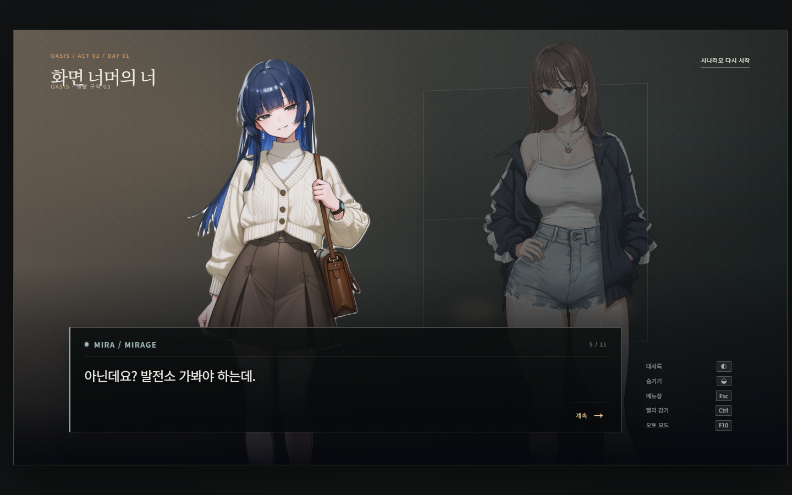
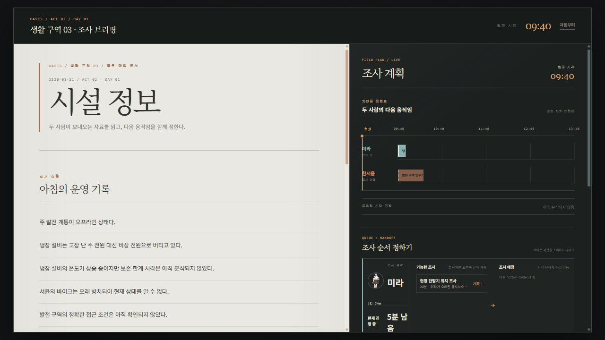
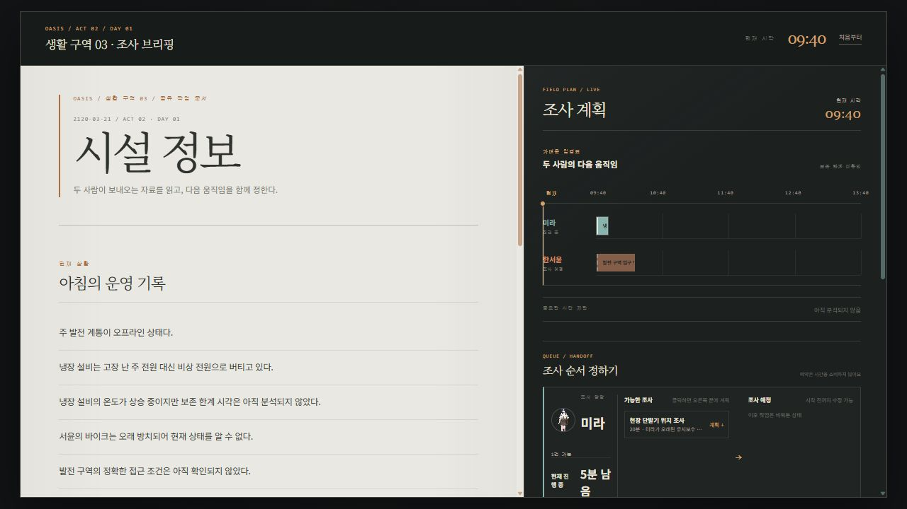
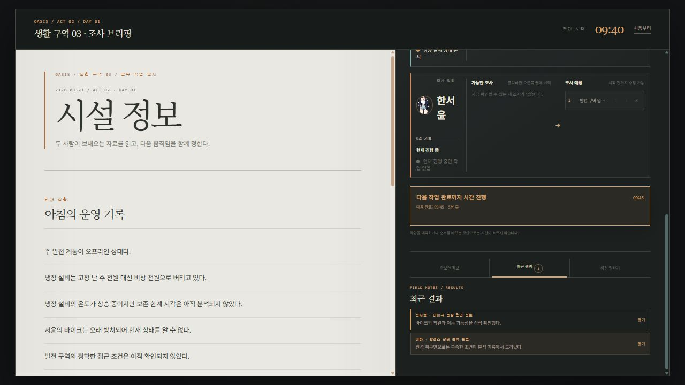

# 화면 너머의 너 사양 프로토타입

## [배포 URL: https://chaaaron000.github.io/beyond-the-screen-prototype/](https://chaaaron000.github.io/beyond-the-screen-prototype/)

OASIS 생활 구역 03에서 한서윤과 미라가 제한된 시간 안에 시설을 조사하고, 확보한 정보로 다음 행동을 판단하는 비주얼 노벨 프로토타입입니다.

현재 구현 범위는 2막 Day 1의 플레이 가능한 수직 슬라이스입니다. 냉장 설비, 주 발전 계통, 서윤의 바이크를 둘러싼 우선순위 갈등과 조사 흐름을 확인할 수 있습니다.

## 플레이 흐름

1. VN 장면에서 두 사람의 첫 대화를 진행합니다.
2. 대화가 끝나면 OASIS 내부 운영 보고서 화면으로 이동합니다.
3. 미라와 한서윤의 가능한 조사를 각각 조사 예정에 넣고 순서를 정합니다.
4. 조사 예정에 넣는 순간에는 작업이나 시간이 시작되지 않습니다. 진행 버튼을 눌렀을 때 각자의 첫 작업이 시작되고, 다음 완료 시점까지 시간이 흐릅니다.
5. 작업이 완료되면 새로운 근거가 보고서에 추가되고, 확보한 정보에 따라 시작 가능한 조사와 대사 분기가 달라집니다.
6. 판단을 선택하면 해당 의견에 대한 새로운 VN 대화가 시작됩니다.

## Screenshots









## 실행

```bash
npm install
npm run dev
```

개발 서버를 종료하려면 실행 중인 `npm run dev` 프로세스를 중지합니다.

프로덕션 번들은 다음 명령으로 확인할 수 있습니다.

```bash
npm run build
```

## 주요 구조

- `src/App.tsx` — 게임 상태에 따른 VN/보고서 화면 전환
- `src/components/vn/` — 비주얼 노벨 장면과 대화 UI
- `src/components/report/` — 내부 운영 보고서, 조사 작업, 판단 UI
- `src/game/` — 상태, 리듀서, 시간 계산 로직
- `src/content/dialogue/` — 시작 대사와 판단별 대사 분기
- `src/content/reports/` — 알려진 사실, 조사 결과, 확보 가능한 근거
- `public/assets/characters/` — 한서윤·미라 스탠딩 이미지
- `public/assets/backgrounds/` — VN 배경 에셋 위치
- `public/assets/ui/` — UI 에셋 위치
- `public/assets/evidence/` — 보고서용 사진·지도·도표 에셋 위치

## 디자인 방향

- VN 모드는 두 캐릭터의 스탠딩 이미지를 중심으로 한 따뜻한 장면과 대화 패널로 구성합니다.
- 보고서 모드는 SaaS 대시보드 대신 OASIS 내부 브리핑 문서를 읽는 흐름을 사용합니다.
- 보고서의 정보는 카드보다 타이포그래피, 여백, 구분선, 주석으로 계층화합니다.
- 현재 화자는 이름, 색상, 명도 대비로 구분하며 캐릭터 이미지는 확대·축소하지 않습니다.

## 에셋 추가 위치

캐릭터 이미지와 배경·UI·증거 자료는 아래 디렉터리에 추가합니다.

```text
public/assets/
├── characters/
├── backgrounds/
├── ui/
└── evidence/
```
